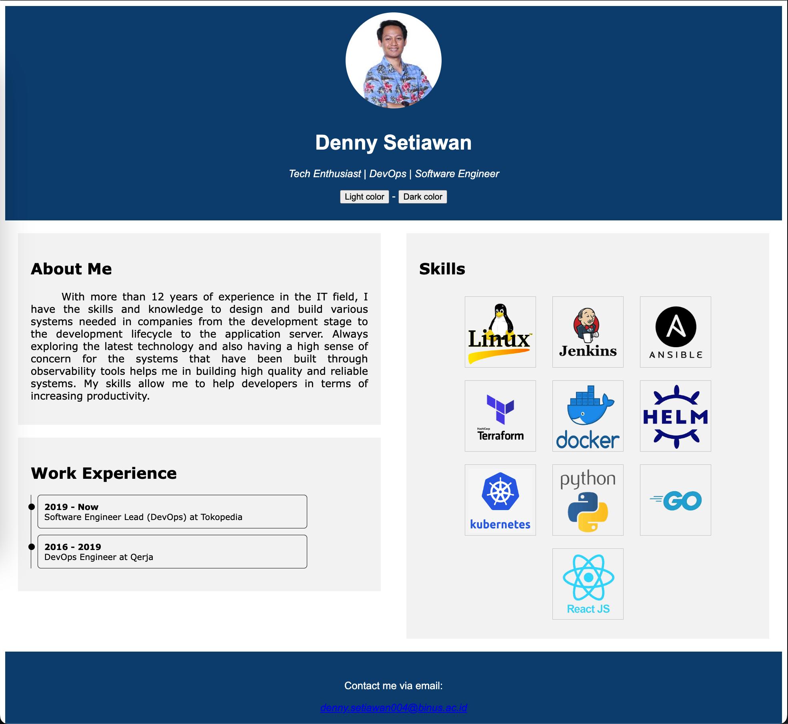

# Personal Assignment

The following source code is used as an answer for a personal assignment in the web programming course.

## Question
Anda diminta untuk membuat halaman profil sederhana yang mencakup informasi dasar tentang seorang individu. Buatlah struktur HTML yang tepat untuk halaman tersebut, gunakan CSS untuk mengatur tata letak dan penampilan halaman, serta gunakan JavaScript untuk menambahkan interaksi, seperti tombol untuk mengganti tema warna halaman.
```
1. Buatlah struktur HTML untuk halaman profil yang terdiri dari elemen-elemen seperti judul, gambar profil, informasi pribadi (nama, alamat, dll.), dan tombol untuk mengganti tema warna.
2. Gunakan CSS untuk mengatur tata letak halaman, gaya teks, dan penampilan elemen-elemen.
3. Implementasikan JavaScript untuk menangani peristiwa klik pada tombol pengganti tema warna. Ketika tombol ditekan, ubah gaya halaman menggunakan CSS untuk mengganti tema warna.
```

## Output of the Answer 
